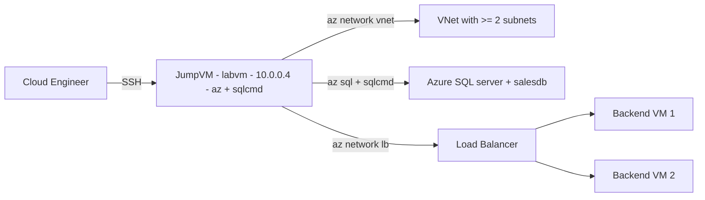

# Azure Infrastructure — VNet, Azure SQL & Load Balancer (Lab 01)

Welcome to your Azure infrastructure hands-on skills assessment. This environment gives you a **Linux JumpVM** pre-loaded with the **Azure CLI** and **sqlcmd**, plus a lab **resource group** in which you build everything. Read this page, then move to **Exercise 1** to begin.

### Overall Estimated timing: 120 Minutes

## Overview

In this assessment you act as a **Cloud Infrastructure Engineer** standing up the foundation for a sales platform on Microsoft Azure. You will design the **network** (a Virtual Network with isolated subnets), deploy a managed **Azure SQL Database** and prove connectivity to it, and put a **Load Balancer** in front of two application VMs for high availability. You are graded on the **state of the Azure resources** you create in your lab resource group.

## Objectives

By the end of this assessment you will have:

1. **Configured a Virtual Network** with at least two subnets that segment application and data tiers.
2. **Deployed an Azure SQL Database** on a logical server, opened a firewall rule, and **connected to it from the JumpVM** with `sqlcmd`.
3. **Configured a Load Balancer** fronting **two backend VMs**, with a backend pool, a health probe, and a load-balancing rule.

## Pre-requisites

Working knowledge of Microsoft Azure: the **Azure CLI** (`az`); core **networking** (Virtual Networks, subnets, address spaces, NSGs); **Azure SQL Database** (logical servers, databases, firewall rules, connection strings); and **Azure Load Balancer** (frontend IP, backend pools, health probes, and load-balancing rules).

## Architecture

A single Ubuntu 22.04 JumpVM is your control plane. From it you run `az` to create a Virtual Network with subnets, an Azure SQL logical server + database, and a Load Balancer fronting two backend VMs — all inside your lab resource group.

## Getting Started with the lab

Your virtual machine and this **Guide** are available within your web browser. Use the **Split Window** button at the top-right to open the guide beside your terminal.

## Accessing Your Lab Environment

1. Connect to the **JumpVM** over SSH using the details on the **Environment** tab.

    - **SSH command:** see the **LABVM SSH Command** output on the **Environment** tab
    - **Username:** see the **LABVM Admin Username** output on the **Environment** tab
    - **Password:** see the **LABVM Admin Password** output on the **Environment** tab

1. Sign in to Azure from the JumpVM before creating resources. CloudLabs supplies your Azure user context:

    - `az login` (follow the device-code / credential prompt), then `az account show` to confirm the active subscription.

1. Discover your lab **resource group** — create every assessed resource inside it:

    - `az group list --query "[].name" -o tsv`

1. If you need the Azure portal at any point, sign in with the credentials below:

    - **Email/Username:** <inject key="AzureAdUserEmail"></inject>

    - **Password:** <inject key="AzureAdUserPassword"></inject>

1. Your environment id for this run is **<inject key="DeploymentID" enableCopy="false"/>** — quote it if you contact support.

### Environment Details

- **One Ubuntu 22.04 JumpVM** (`labvm-<DeploymentID>`, `Standard_D2s_v3`, `10.0.0.4`) with the **Azure CLI** and **sqlcmd** pre-installed.
- A base `labvNet` and lab **resource group** are provisioned for you; the JumpVM lives in the base VNet. You create the **assessed** VNet, Azure SQL server/database, and Load Balancer yourself.
- `/home/labuser/README.txt` records the topology and per-scenario hints.

## Track Your Progress

Use the **Validate** button on each task to check your work. The **Progress** tab shows your validation score; it reaches 100% when all task validations pass.

## Lab Duration Extension

You have **120 minutes** for this assessment. If you need more time, click the **Hourglass** icon in the top-right of the lab environment (it appears when 10 minutes remain) and click **OK**.

## Support Contact

The CloudLabs support team is available 24/7 via email and live chat.

- Email Support: cloudlabs-support@spektrasystems.com
- Live Chat Support: https://cloudlabs.ai/labs-support

Click **Next** to begin Exercise 1.

## Happy Assessing !!
